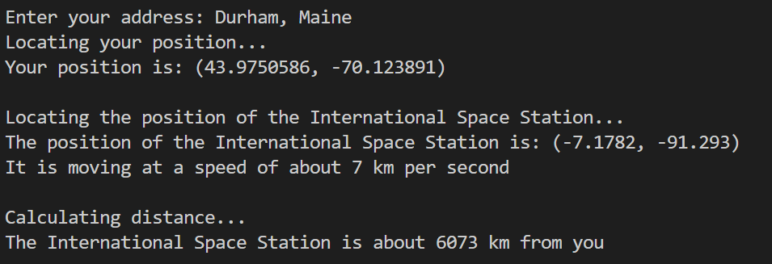

# ISS Tracker

  
## A Python program to track the International Space Station

ISS Tracker is a Python program to track the international space station and to
compare it's position to any other position on Earth. 

The project was a good chance to learn about Python's geopy library, which makes
it easy to locate the coordinates of an address by abstracting the API services of 
various geolocation services, such as Google Maps and Nominatim. The project was 
also an opportunity to learn about latitude and longitude and calculating the 
distance between sets of two coordinates using the haversine forumla. 

## Demo

## Instructions
Clone the git repo and run main.py